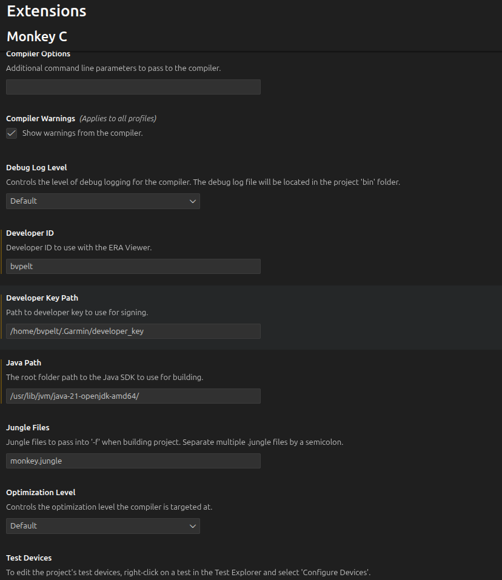

# Setup a new project

## Visual code

### Install monkey c extension from garmin
- Set path to developer_key
- Set path to java

In my case


### Install custom formatter van killian
This makes it possible to use a custom formatter. In this case clang-format.
This works by using:
- clang-format on ubuntu
- the visual code extension Clang-Format by xaver.clang-format

**Install clang-format on ubuntu**
```bash
sudo apt install clang-format
```

**Install Clang-Format extension in visual code**

Define a configuration file [.clang-format](./.clang-format) 

Update setting.json 

Control-Shift-P `Preferences: Open User Settings (Json)`

```json
{
  "editor.defaultFormatter": "esbenp.prettier-vscode",
  "customLocalFormatters.formatters": [
    {
      "command": "clang-format -style=file --assume-filename=test.java",
      "languages": ["monkeyc"],
    },
  ],
  "[monkeyc]": {
    "editor.defaultFormatter": "jkillian.custom-local-formatters",
    "editor.formatOnSave": true,
  },
  "monkeyC.developerKeyPath": "/home/bvpelt/.Garmin/developer_key",
  "monkeyC.developerId": "bvpelt",
  "monkeyC.javaPath": "/usr/lib/jvm/java-21-openjdk-amd64/",
  "liveServer.settings.donotShowInfoMsg": true,
}
```

## Create directory structure

```bash
# Create directory structure
mkdir -p source
mkdir -p resources/{properties,settings,strings,drawables,layouts}
```

## Create manifest.xml

```xml
<?xml version="1.0"?>
<iq:manifest version="3" xmlns:iq="http://www.garmin.com/xml/connectiq">
    <iq:application 
        id="garmin-messenger-app" 
        type="watchface" 
        name="@Strings.AppName" 
        entry="MessengerApp" 
        launcherIcon="@Drawables.LauncherIcon" 
        minApiLevel="3.2.0">
        
        <iq:products>
            <iq:product id="fr165"/>
            <iq:product id="fr245"/>
            <iq:product id="fr255"/>
            <iq:product id="fr265"/>
            <iq:product id="fr955"/>
            <iq:product id="fr965"/>
        </iq:products>
        
        <iq:permissions>
            <iq:uses-permission id="Communications"/>
            <iq:uses-permission id="UserProfile"/>
        </iq:permissions>
        
        <iq:languages>
            <iq:language>eng</iq:language>
        </iq:languages>
        
        <iq:barrels/>
    </iq:application>
</iq:manifest>
```

After creation of the manifest.xml, use the monkey c editor to create a unique app uuid for this app.

## Create monkey.jungle

**monkey.jungle:**
```
project.manifest = manifest.xml

base.resourcePath = resources
base.sourcePath = source
```

### Create Resource Files

#### Create Strings
In resources/strings/strings.xml put

```xml
<strings>
    <string id="AppName">Messenger Watch</string>
    
    <!-- View names -->
    <string id="ClockView">Clock</string>
    <string id="MessagesView">Messages</string>
    
    <!-- Messages -->
    <string id="NoMessages">No messages</string>
    <string id="Connecting">Connecting...</string>
    <string id="Connected">Connected</string>
    <string id="Disconnected">Disconnected</string>
    
    <!-- Settings -->
    <string id="ViewModeTitle">Default View</string>
    <string id="ViewModeClock">Clock</string>
    <string id="ViewModeMessages">Messages</string>
    
    <string id="ShowNotificationsTitle">Show Notifications</string>
    <string id="MessageLimitTitle">Message History</string>
</strings>
```

#### Create properties
In resources/properties/properties.xml put

```xml
<properties>
    <property id="DefaultView" type="number">0</property>
    <property id="ShowNotifications" type="boolean">true</property>
    <property id="MessageLimit" type="number">10</property>
</properties>
```

#### Create settings
In resources/settings/settings.xml put

```xml
<settings>
    <setting propertyKey="@Properties.DefaultView" title="@Strings.ViewModeTitle">
        <settingConfig type="list">
            <listEntry value="0">@Strings.ViewModeClock</listEntry>
            <listEntry value="1">@Strings.ViewModeMessages</listEntry>
        </settingConfig>
    </setting>
    
    <setting propertyKey="@Properties.ShowNotifications" title="@Strings.ShowNotificationsTitle">
        <settingConfig type="boolean"/>
    </setting>
    
    <setting propertyKey="@Properties.MessageLimit" title="@Strings.MessageLimitTitle">
        <settingConfig type="numeric" min="5" max="50"/>
    </setting>
</settings>
```

#### Create icons
In resources/drawables/drawables.xml put

```xml
<drawables>
    <bitmap id="LauncherIcon" filename="launcher_icon.png" />
</drawables>
```


# Finding errors

In /tmp/com.garmin.connectiq/GARMIN/APPS/LOGS/CIQ_LOG.YML there is information of the simulator.

# Python

Setup the environment

```bash
cd pyutil
python3 -m venv .venv
```

Using environment
```bash
cd pyutil
source .venv/bin/activate

pip install pip-tools

pip install flask
pip install flask_cors
```